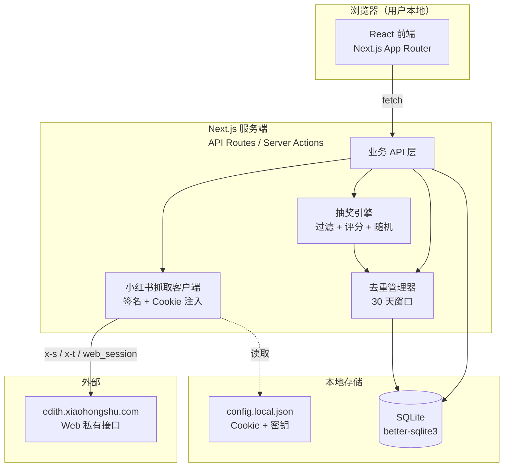
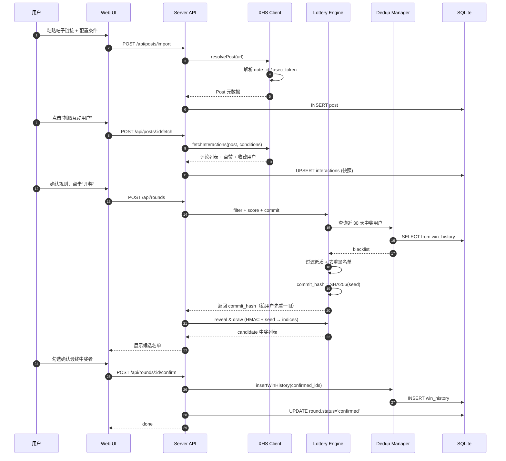
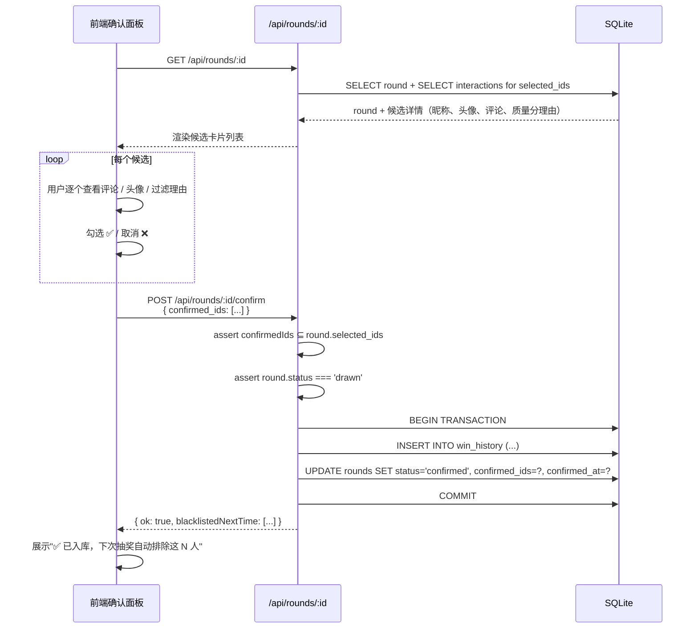

# Design Document: 小红书自动抽奖系统（xhs-lottery-system）

> **定位**：网页端单用户自用。博主本人登录小红书后，粘贴帖子链接 → 选条件 → 抽出候选 → 人工确认 → 入库去重。
>
> **语言/栈**：TypeScript（用户背景偏好 + RN 经验平滑迁移）。

---

## 0. 调研小节（核心——先搞清楚可行性再谈架构）

这节的目的是回答用户最关心的那个问题：**「我们爱抽奖」明明不是小红书官方，怎么一粘贴链接就能拿到点赞/收藏/评论列表？**

### 0.1 小红书官方开放平台现状

- 入口：[小红书开放平台（school.xiaohongshu.com/open）](https://school.xiaohongshu.com/en/open/quick-start/workflow.html)、千帆（商家）、蒲公英（品牌）、灵犀（广告）
- 接入流程：沙盒申请 → 拿 `app-key / app-secret` → 沙盒测试 → **联系小红书技术对接** → 上生产。([来源：Integration guide 第 0-5 步](https://school.xiaohongshu.com/en/open/quick-start/workflow.html))
- 面向对象：**品牌商、MCN、电商服务商**。接口清单以商品/订单/物流/直播为主，没有「拉取某篇笔记的点赞用户列表」这种 C 端数据能力。
- **个人开发者结论：拿不到官方授权**。部分第三方（如 [justoneapi](https://github.com/justoneapi-01/xiaohongshu-api)、[rnote.dev](https://rnote.dev/)、[RapidAPI xiaohongshu-all-api](https://rapidapi.com/dataapiman/api/xiaohongshu-all-api)）自称"小红书 API"，实质全是"封装好的爬虫代理"，按次/按量收费，本质还是走 Web 私有接口。

### 0.2 「我们爱抽奖」小程序的技术路径推理

微信小程序体积受限（主包 2MB，分包 20MB），不可能内置完整浏览器自动化（Playwright/Puppeteer）。它只负责「粘贴链接 → 请求自己服务器 → 拿到列表」，**真正的抓取发生在服务端**。

#### 服务端最可能的三种实现

| 方式 | 原理 | 稳定性 | 成本 |
|---|---|---|---|
| **A. Web 端签名 + Cookie 池（大概率）** | 服务端维护一批已登录的 web_session cookie，逆向 `x-s / x-t / x-s-common` 签名，直接请求 `edith.xiaohongshu.com/api/sns/web/v1/...` | 中。要 Cookie 池轮换、要跟签名升级 | 低 |
| **B. 真机/云手机模拟** | 一批托管 Android 设备，自动化 APP，抓本地接口 | 高 | 硬件 + 电费 |
| **C. 透传用户自己的 Cookie** | 让用户先登录小红书/把 cookie 贴给服务端，请求以「用户身份」发出 | 高（用户身份限流阈值比游客高得多） | 极低 |

#### 为什么判断主流是 A + C 的组合

1. **签名已完全开源**。[MediaCrawler 源码分析文章](https://juejin.cn/post/7349707080246476838) 明确拆过 `_pre_headers` + `sign()` 的实现，`x-s-common` 里 `s0/x1/x2/...x10` 每个字段含义都有说明；[ReaJason/xhs](https://github.com/ReaJason/xhs)、[xuzuoyun/xhs-web-sign](https://github.com/xuzuoyun/xhs-web-sign) 也能直接算出合法签名。
2. **关键接口是「已登录可见」而非「公开游客可见」**。笔记详情、评论分页、点赞用户列表这些接口，博主本人登录后在 web.xiaohongshu.com 创作中心 / 数据中心是能看到的，服务端只要"冒充博主浏览器"就能拿到。
3. **游客模式容易踩 461**。[MediaCrawler Issue #757](https://github.com/NanmiCoder/MediaCrawler/issues/757) 显示未登录或 Cookie 老化时，`edith.xiaohongshu.com/api/sns/web/v1/search/notes` 直接返回 `461 status code 461`（触发 Verifytype 滑块），所以**带一份真实 web_session 才是稳定路径**。
4. **点赞/收藏列表的"前提"是身份**。粉丝可见范围 / 博主专属可见接口返回的数据量级不同。授权 Cookie 路线能解释"为什么它好像拿到了你自己才能看到的东西"。

> 一句话总结：**小程序在后端跑着一套"签名 + 登录态"的抓取器，对外只露出一个「给我链接」的 RPC**。

### 0.3 三条路线对比

| 维度 | 爬虫（游客 Cookie / 账号池） | 授权 Cookie（博主自己登录态） | 官方 API |
|---|---|---|---|
| **数据可得性** | 中。评论基本稳；点赞/收藏视登录等级可能不全 | **高**。博主本人视角能看到自己帖子的完整互动列表 | 低。无对应能力 |
| **稳定性** | 低。签名升级、滑块验证（461/Verifytype）、账号被封 | 中高。单账号只做自己帖子，频次低，不踩风控阈值 | 极高（但拿不到） |
| **账号风险** | **高**。大规模调用会封号（[MediaCrawler 多个 issue 印证](https://github.com/NanmiCoder/MediaCrawler/issues/855)） | 低。每月抽几次，请求量 <1000 级 | 无 |
| **合规** | 灰色。`robots.txt` 无明文禁止但平台 ToS 不允许 | **最好**。数据是用户自己的内容互动数据，自己使用 | 合规 |
| **实现难度** | 高（逆向 + 池化 + 代理） | **低**（直接跑社区已有签名库） | 低（但申请不通过） |
| **适合本项目？** | ❌ 过度工程 | ✅ **推荐** | ❌ 申请不到 |

### 0.4 推荐路线：授权 Cookie（Authorized Cookie Passthrough）

**做法**：用户先在 Chrome 登录 xiaohongshu.com，浏览器插件或 DevTools 手动复制 `web_session`（和 `a1`、`webId` 等最小必要字段）粘贴进本地工具，服务端以这组 Cookie 做身份，走签名调用 `edith.xiaohongshu.com` Web API。

**选它的四个理由**：

1. **合规边界清晰**。数据来源是博主自己的帖子、自己的互动用户，调用频次等同于自己刷浏览器。
2. **稳定**。单账号、单帖子、低频次，远低于小红书风控阈值。
3. **省心**。不用维护 Cookie 池、代理池、滑块识别，开箱即用。
4. **技术成熟**。签名算法、接口路径、字段结构在多个开源库里有现成实现可参考。

**它的代价**：

- 需要用户手动刷新 Cookie（web_session 有效期大约 30 天左右，过期要重登）。
- 签名算法可能升级（历史上 `x-s` 算法变过几次）——需要关注社区库（如 ReaJason/xhs）更新频率。
- 仍然是"非官方调用"，**平台随时可能调整**。这点必须写进用户协议。

### 0.5 调研来源链接

- [小红书开放平台 · Integration guide](https://school.xiaohongshu.com/en/open/quick-start/workflow.html)
- [小红书开放平台 · How to Get App-key & App-secret](https://school.xiaohongshu.com/en/open/quick-start/how-to-get-app-key.html)
- [MediaCrawler README（NanmiCoder）](https://github.com/NanmiCoder/MediaCrawler/blob/main/README.md)
- [MediaCrawler 小红书爬虫源码分析（掘金）](https://juejin.cn/post/7349707080246476838)
- [MediaCrawler Issue #757 · 461 状态码复现](https://github.com/NanmiCoder/MediaCrawler/issues/757)
- [ReaJason/xhs · Web 端请求封装（Python）](https://github.com/ReaJason/xhs)
- [xuzuoyun/xhs-web-sign · x-t x-s 逆向](https://github.com/xuzuoyun/xhs-web-sign)
- [justoneapi / xiaohongshu-api · 第三方 API 聚合示例](https://github.com/justoneapi-01/xiaohongshu-api)
- [rnote.dev · 付费小红书 API 服务](https://rnote.dev/)
- [更加优雅的反黑幕抽奖思路（seed + 可复现算法）](https://linux.do/t/topic/365515)
- [Chainlink · Provably Fair Randomness](https://chain.link/article/provably-fair-randomness)
- [vitozyf/lucky-draw · 年会抽奖开源参考](https://github.com/vitozyf/lucky-draw)

---

## 1. High-Level Design（高层设计）

### 1.1 系统架构图



### 1.2 模块划分

| 模块 | 目录建议 | 职责 | 关键依赖 |
|---|---|---|---|
| **Web UI** | `app/` | 链接输入、条件配置、候选预览、手动确认面板 | Next.js 14 App Router、shadcn/ui、Tailwind |
| **XHS 抓取客户端** | `lib/xhs/` | 解析链接 → 拉笔记详情 / 评论 / 点赞 / 收藏用户 → 归一化 | `crypto`（签名）、`undici`（HTTP） |
| **签名器** | `lib/xhs/sign.ts` | 生成 `x-s / x-t / x-s-common / x-b3-traceid` | 参考 [ReaJason/xhs 实现](https://github.com/ReaJason/xhs) |
| **抽奖引擎** | `lib/lottery/` | 条件 AND/OR 过滤 → 低质评分 → 可验证随机 | `crypto.createHmac` |
| **去重管理器** | `lib/dedup/` | 30 天内中奖过的用户进"黑名单"、抽前自动剔除 | better-sqlite3 |
| **持久化** | `lib/db/` | Schema、迁移、查询辅助 | drizzle-orm 或 raw SQL |
| **配置** | `config.local.json` | Cookie、HMAC 密钥、抽奖偏好（用户手动编辑/前端写入） | — |

### 1.3 数据模型

> 所有表都建在本地单文件 SQLite。自用场景不需要考虑并发写。

```typescript
// ========== 帖子（每导入一条链接落一行） ==========
interface Post {
  id: string;              // note_id，从链接解析
  xsec_token: string;      // 小红书链接里的 xsec_token，调接口必需
  title: string;
  author_id: string;
  author_name: string;
  created_at: number;      // 帖子发布时间
  imported_at: number;
  raw_url: string;
}

// ========== 互动用户（一次抓取 = 一次快照） ==========
interface Interaction {
  id: number;              // autoincrement
  post_id: string;
  user_id: string;         // 小红书 user_id（稳定主键）
  user_nickname: string;
  user_avatar: string;
  user_follows_count?: number;  // 该用户关注数（低质过滤用）
  user_fans_count?: number;
  types: InteractionType[];     // ['like','collect','follow','comment'] 子集
  comment_text?: string;        // 只对 type 含 comment 的填
  comment_created_at?: number;
  fetched_at: number;
}

type InteractionType = 'like' | 'collect' | 'follow' | 'comment';

// ========== 抽奖轮次 ==========
interface DrawRound {
  id: string;              // uuid
  post_id: string;
  prize_name: string;      // 仅展示，不参与过滤
  winner_count: number;
  rules: LotteryRules;     // 条件 + 关系 + 过滤阈值（快照，保证可复现）
  seed: string;            // HMAC 原料：post_id + timestamp + user_secret
  commit_hash: string;     // seed 的 SHA-256，"开奖前可先公布"
  candidate_ids: string[]; // 经过滤、排序后进入抽奖池的 user_id 列表（有序）
  selected_ids: string[];  // 随机算法选出的候选
  confirmed_ids: string[]; // 用户手动勾选确认入库的最终中奖名单
  status: 'drafted' | 'drawn' | 'confirmed';
  drawn_at: number;
  confirmed_at?: number;
}

interface LotteryRules {
  conditions: InteractionType[];   // 选中的条件
  relation: 'AND' | 'OR';
  filters: {
    minFollowsRatio?: number;      // 粉丝数/关注数，低于此值视为专职抽奖号
    maxFollowsCount?: number;      // 关注数上限（>1000 疑似抽奖号）
    lowQualityCommentThreshold?: number; // 0-1，低质分 >= 阈值则过滤
  };
}

// ========== 30 天中奖黑名单 ==========
interface WinHistory {
  user_id: string;
  last_won_at: number;
  last_round_id: string;
  prize_name: string;
  // 索引：(user_id) unique, (last_won_at) for 窗口查询
}
```

### 1.4 核心流程图



### 1.5 关键流程：两阶段开奖（Commit-Reveal）

抽奖算法推荐走 **commit-reveal**，即便单用户自用也做"给未来的自己留一个审计凭证"：

1. **Commit（开奖前）**：用帖子 ID + 当前时间戳 + 本地 HMAC 密钥生成 `seed`，把 `SHA-256(seed)` 写进轮次记录，UI 展示给用户复制留存。此时 `seed` 本身还在服务器保密。
2. **Reveal（开奖时）**：HMAC-DRBG 伪随机数基于 `seed` 生成 N 个索引，从候选池选中。
3. **事后验证**：任何人只要拿到 `seed` 和候选名单，就能复算出同样的中奖结果；如果 commit 哈希对不上，说明 seed 被篡改。

这套做法是[社区反黑幕抽奖的通用模式](https://linux.do/t/topic/365515)，比"直接 Math.random()"可信得多，且依然简单。

---

## 2. Low-Level Design（详细设计）

### 2.1 小红书数据抓取客户端

#### 2.1.1 链接解析

小红书分享链接有多种形态：
- `https://www.xiaohongshu.com/explore/{noteId}?xsec_token=XXX&xsec_source=pc_feed`
- `https://www.xiaohongshu.com/discovery/item/{noteId}?xsec_token=XXX`
- APP 分享短链：`http://xhslink.com/a/xxxx`（需要先 HEAD 跟随 302 拿到 Location）

```typescript
interface ParsedPostLink {
  noteId: string;
  xsecToken: string;
  xsecSource: string;
}

async function parseXhsUrl(rawUrl: string): Promise<ParsedPostLink> {
  // 1. 短链展开：xhslink.com → 真实 URL
  let url = rawUrl.trim();
  if (url.includes('xhslink.com')) {
    const res = await fetch(url, { method: 'HEAD', redirect: 'manual' });
    url = res.headers.get('location') ?? url;
  }

  // 2. 从 pathname 提 noteId
  const u = new URL(url);
  const noteId = u.pathname.split('/').filter(Boolean).pop()!;

  // 3. 从 query 提 xsec_token（调接口必需，缺失会 400）
  const xsecToken = u.searchParams.get('xsec_token') ?? '';
  const xsecSource = u.searchParams.get('xsec_source') ?? 'pc_feed';

  if (!noteId || !xsecToken) {
    throw new Error('链接无效：缺少 note_id 或 xsec_token。请直接从网页版地址栏复制完整 URL。');
  }
  return { noteId, xsecToken, xsecSource };
}
```

#### 2.1.2 签名生成（x-s / x-t / x-s-common）

完整算法在 MediaCrawler 和 ReaJason/xhs 里有现成实现，Node 侧推荐直接移植（纯 JS，无浏览器依赖）。核心输入输出：

```typescript
interface SignInput {
  uri: string;            // 例如 '/api/sns/web/v1/comment/page'
  data?: unknown;         // POST body；GET 时传 undefined
  a1: string;             // 来自 cookie 的 a1 字段
  b1: string;             // 来自 localStorage 的 b1（可以每次固定一个值）
}

interface SignHeaders {
  'x-s': string;
  'x-t': string;          // 毫秒时间戳
  'x-s-common': string;   // base64(JSON(...common字段))
  'x-b3-traceid': string; // 16 位十六进制随机
}

function sign(input: SignInput): SignHeaders {
  // 伪代码：细节参考 https://github.com/ReaJason/xhs
  const xt = Date.now().toString();
  const xs = computeXs(input.uri, input.data, xt, input.a1);   // MD5+salt
  const common = {
    s0: 5, x1: '3.7.x', x2: 'Mac OS', x3: 'xhs-pc-web',
    x5: input.a1, x6: xt, x7: xs, x8: input.b1,
    x9: mrc(xt + xs + input.b1), x10: 1,
  };
  return {
    'x-s': xs,
    'x-t': xt,
    'x-s-common': base64(JSON.stringify(common)),
    'x-b3-traceid': randomHex(16),
  };
}
```

> ⚠️ 签名算法约每年 1-2 次升级。实现时把 `computeXs` / `mrc` 这些内部函数独立成一个子模块，方便之后按社区库版本替换。**不要自己硬逆向**——学习成本高，维护成本更高。

#### 2.1.3 请求封装与风控规避

```typescript
class XhsClient {
  private cookie: string;       // web_session=xxx; a1=xxx; webId=xxx
  private a1: string;
  private baseURL = 'https://edith.xiaohongshu.com';

  async get<T>(uri: string, params?: Record<string, string>): Promise<T> {
    const headers = sign({ uri, a1: this.a1, b1: FIXED_B1 });
    const res = await fetch(`${this.baseURL}${uri}?${qs(params)}`, {
      headers: {
        ...headers,
        cookie: this.cookie,
        'user-agent': UA_CHROME_MAC,
        referer: 'https://www.xiaohongshu.com/',
        origin: 'https://www.xiaohongshu.com',
      },
    });
    if (res.status === 461) {
      throw new XhsRiskControlError('触发滑块验证，请去浏览器登录一次刷新 Cookie');
    }
    if (res.status === 401 || res.status === 403) {
      throw new XhsAuthError('Cookie 过期，请重新获取 web_session');
    }
    const body = await res.json() as { success: boolean; code: number; msg: string; data: T };
    if (!body.success) throw new XhsApiError(body.code, body.msg);
    return body.data;
  }
}
```

**风控规避的几条硬规矩**（代码层面强制，详见 §4.4 安全阀）：

1. **请求间隔 ≥ 1.5s**，分页加随机抖动 300-800ms。官方 Web 翻页本身节奏也差不多。
2. **单帖单次抓取上限 1000 条**：评论多到破万的帖子只抓高赞前 N 条，这是官方 Web 端自己也只会加载头部的习惯。
3. **串行不并行**：不要同时起多个 XhsClient 对同一个 cookie 猛打。
4. **不主动做"关注列表抓取"**：用户个人主页的关注/粉丝列表拉取容易被风控盯上（正常用户几乎不会连续批量请求这类接口，行为指纹明显异常）。**本系统永远不抓这个维度**——关注条件通过互动用户对象自带的 `followed: boolean` 字段间接判断。
5. **Cookie 失效优雅降级**：识别 461 / 401 立即停止、提示用户，不要硬重试。
6. **自帖校验**（重要）：每次抓取前先校验帖子作者是否为当前登录账号本人，**拒绝对他人帖子的任何调用**。
7. **Cookie 健康度自检**：每次启动 + 每次开奖前主动探测一次账号状态，异常立即停下。

#### 2.1.4 抓取互动用户的伪代码

```typescript
async function fetchInteractions(
  client: XhsClient,
  post: ParsedPostLink,
  conditions: InteractionType[],
): Promise<Map<string, Interaction>> {
  const users = new Map<string, Interaction>();

  // ---- 评论（含二级评论） ----
  if (conditions.includes('comment')) {
    let cursor = '';
    do {
      const page = await client.get<CommentPage>('/api/sns/web/v2/comment/page', {
        note_id: post.noteId,
        cursor,
        top_comment_id: '',
        image_formats: 'jpg,webp,avif',
        xsec_token: post.xsecToken,
      });
      for (const c of page.comments) {
        mergeUser(users, {
          user_id: c.user_info.user_id,
          user_nickname: c.user_info.nickname,
          user_avatar: c.user_info.image,
          types: ['comment'],
          comment_text: c.content,
          comment_created_at: c.create_time,
        });
        // 二级评论（楼中楼）同样遍历 c.sub_comments
        for (const sub of c.sub_comments ?? []) {
          mergeUser(users, { /* ... */ });
        }
      }
      cursor = page.cursor;
      await sleep(1500 + Math.random() * 600);
    } while (cursor);
  }

  // ---- 点赞 ----
  if (conditions.includes('like')) {
    // 接口：/api/sns/web/v1/note/liked
    // 注意：博主本人 Cookie 请求自己笔记，才能拿到完整列表
    let cursor = '';
    do {
      const page = await client.get<LikedPage>('/api/sns/web/v1/note/liked', {
        note_id: post.noteId,
        cursor,
        xsec_token: post.xsecToken,
      });
      for (const u of page.users) mergeUser(users, { ...u, types: ['like'] });
      cursor = page.cursor;
      await sleep(1500 + Math.random() * 600);
    } while (cursor && page.has_more);
  }

  // ---- 收藏 ----
  if (conditions.includes('collect')) {
    // 接口：/api/sns/web/v1/note/collected（博主本人视角）
    // 分页形式与点赞类似，略
  }

  // ---- 关注（间接判定） ----
  if (conditions.includes('follow')) {
    // 不抓粉丝列表（风控极敏感）
    // 做法：fetchAuthorFans(authorId) 分段抓"博主粉丝列表"，比 "用户的关注列表" 更直接且阈值更高
    // 或者：在点赞/评论用户明细中读 `followed` 字段（小红书返回结构里通常有）
  }

  return users;
}

function mergeUser(map: Map<string, Interaction>, i: Partial<Interaction>) {
  const existing = map.get(i.user_id!);
  if (existing) {
    existing.types = Array.from(new Set([...existing.types, ...i.types!]));
    if (i.comment_text && !existing.comment_text) {
      existing.comment_text = i.comment_text;
    }
  } else {
    map.set(i.user_id!, i as Interaction);
  }
}
```

> **关于"关注"条件的真实可得性**：点赞/评论列表返回的每条 user 对象通常带 `followed: boolean` 字段（表示该用户是否关注了当前登录账号，也就是博主）。只要博主用自己 Cookie 请求，就能拿到"这个点赞的人有没有关注我"的布尔值，不需要额外拉粉丝列表。**这是授权 Cookie 路线的最大优势**。

### 2.2 抽奖算法（commit-reveal + HMAC-DRBG）

```typescript
import { createHash, createHmac, randomBytes } from 'node:crypto';

interface DrawInput {
  poolIds: string[];       // 过滤后的候选用户 ID（已按 user_id 字典序排好）
  winnerCount: number;
  userSecret: string;      // 保存在 config.local.json，仅本地
}

interface DrawResult {
  seed: string;            // hex，reveal 时公布
  commitHash: string;      // sha256(seed)，抽奖前公布
  winners: string[];       // 选出的 user_id 列表，按选出顺序
  indices: number[];       // winners 对应 poolIds 的下标，便于审计
}

function draw(input: DrawInput): DrawResult {
  const { poolIds, winnerCount, userSecret } = input;
  if (poolIds.length < winnerCount) {
    throw new Error(`候选池只有 ${poolIds.length} 人，不够抽 ${winnerCount} 个`);
  }

  // 1. 生成 seed（放本地熵源 + 用户密钥；可额外混入当日区块链哈希加强）
  const seed = randomBytes(32).toString('hex');
  const commitHash = createHash('sha256').update(seed).digest('hex');

  // 2. HMAC-DRBG：用 seed 派生无限随机字节流
  const indices = new Set<number>();
  const winners: number[] = [];
  let counter = 0;
  while (winners.length < winnerCount) {
    const hmac = createHmac('sha256', userSecret)
      .update(seed)
      .update(Buffer.from([counter++]))
      .digest();
    // 把 32 字节切成 8 个 uint32，逐个模池大小
    for (let off = 0; off < 32 && winners.length < winnerCount; off += 4) {
      const raw = hmac.readUInt32BE(off);
      const idx = raw % poolIds.length;
      if (!indices.has(idx)) {
        indices.add(idx);
        winners.push(idx);
      }
    }
  }

  return {
    seed,
    commitHash,
    winners: winners.map(i => poolIds[i]),
    indices: winners,
  };
}

// 验证器（任何人拿到 seed 可复算）
function verify(
  poolIds: string[], winnerCount: number, userSecret: string,
  publishedSeed: string, publishedWinners: string[],
): boolean {
  const result = draw({ poolIds, winnerCount, userSecret });
  // 注：seed 需要用 publishedSeed 替换，而非重新生成
  // 真实 verify 函数会接收 seed 作为参数，不再自己产生
  return JSON.stringify(result.winners) === JSON.stringify(publishedWinners);
}
```

**为什么选 HMAC-DRBG 而不是直接 `Math.random()` 或区块哈希**：

- `Math.random()` 不可复现、不可审计。
- 纯区块哈希（Bitcoin/Ethereum block hash）在加密社区有"矿工可延后 1 块的小幅偏置"争议，对小额抽奖过度工程。
- HMAC-DRBG 基于 [NIST SP 800-90A](https://chain.link/article/provably-fair-randomness)，确定性伪随机，有 seed 就能复算，没 seed 就无法预测，是"可验证随机"的工业标准。
- 想增强抗共谋：在 seed 里混入"开奖日之后某个区块的 hash"就好，格式：`seed = HMAC(userSecret, post_id || timestamp || future_block_hash)`。单用户自用不必做到这一步。

### 2.3 AND / OR 过滤器数据结构

用位图（BitSet）+ 条件表达式最简洁：

```typescript
// 每个用户对每个条件的命中情况，用 4 bit 表示（like | collect | follow | comment）
const BIT_LIKE    = 1 << 0;
const BIT_COLLECT = 1 << 1;
const BIT_FOLLOW  = 1 << 2;
const BIT_COMMENT = 1 << 3;

function buildUserBits(i: Interaction): number {
  let bits = 0;
  if (i.types.includes('like'))    bits |= BIT_LIKE;
  if (i.types.includes('collect')) bits |= BIT_COLLECT;
  if (i.types.includes('follow'))  bits |= BIT_FOLLOW;
  if (i.types.includes('comment')) bits |= BIT_COMMENT;
  return bits;
}

function buildRuleMask(conditions: InteractionType[]): number {
  return conditions.reduce((m, c) => m | conditionBit(c), 0);
}

function matches(userBits: number, mask: number, relation: 'AND' | 'OR'): boolean {
  if (relation === 'AND') return (userBits & mask) === mask;   // 全中
  return (userBits & mask) !== 0;                              // 任意一条
}

// 过滤流程
function filterCandidates(
  users: Interaction[],
  rules: LotteryRules,
  blacklist: Set<string>,
): Interaction[] {
  const mask = buildRuleMask(rules.conditions);
  return users.filter(u =>
    matches(buildUserBits(u), mask, rules.relation)
    && !blacklist.has(u.user_id)
    && passesQualityFilter(u, rules.filters),
  );
}
```

**为什么用位运算**：条件只有 4 个，用 BitSet 一次 `&` 就能判 AND/OR，比嵌套 if 清晰、比 `Array.every` 快 10 倍左右。单用户几千级候选，性能差距不重要，但**代码可读性和可扩展性更重要**——以后想加"浏览"条件，加一个 bit 就行。

### 2.4 低质 / 高危用户评分

```typescript
interface QualityScore {
  total: number;     // 0-1，越高越可疑，>= threshold 则剔除
  reasons: string[]; // 解释给用户看：为什么被过滤
}

function scoreUser(u: Interaction): QualityScore {
  let score = 0;
  const reasons: string[] = [];

  // ---- 账号维度（如果能拿到） ----
  if (u.user_follows_count !== undefined) {
    if (u.user_follows_count > 2000) {
      score += 0.4;                           // 权重 0.4
      reasons.push(`关注数过高（${u.user_follows_count}），疑似专职抽奖号`);
    }
    if (u.user_fans_count !== undefined && u.user_fans_count < 5
        && u.user_follows_count > 500) {
      score += 0.3;                           // 权重 0.3
      reasons.push('关注多粉丝少，典型羊毛号特征');
    }
  }

  // ---- 评论维度 ----
  if (u.types.includes('comment') && u.comment_text) {
    const text = u.comment_text.trim();

    // 过短
    if (text.length <= 2) {
      score += 0.25; reasons.push(`评论过短（${text.length} 字）`);
    }

    // 纯表情/符号
    if (/^[\p{Emoji}\p{P}\s]+$/u.test(text)) {
      score += 0.3; reasons.push('评论仅含表情或标点');
    }

    // 纯数字
    if (/^\d+$/.test(text)) {
      score += 0.3; reasons.push('评论仅含数字');
    }

    // 模板套话（可扩展的 pattern 列表）
    const TEMPLATES = [
      /^冲冲冲+$/, /^抽我抽我+$/, /^接好运$/, /^蹲/, /^in\b/i,
      /^我要\w?$/, /^想要$/, /^求中$/, /^大佬好$/,
    ];
    if (TEMPLATES.some(p => p.test(text))) {
      score += 0.2; reasons.push('评论为常见抽奖模板话');
    }

    // 复制粘贴（与帖子标题或博主上一条模板评论高度相似）
    // 实现：levenshtein(text, referenceText) / max.length < 0.2 视为照抄
  }

  return { total: Math.min(score, 1), reasons };
}

function passesQualityFilter(
  u: Interaction,
  filters: LotteryRules['filters'],
): boolean {
  const threshold = filters.lowQualityCommentThreshold ?? 0.6;
  const { total } = scoreUser(u);
  return total < threshold;
}
```

**字段 + 权重 + 阈值汇总**：

| 字段 | 判定规则 | 权重 | 备注 |
|---|---|---|---|
| `user_follows_count` | `> 2000` | 0.40 | 疑似专职抽奖号 |
| `user_fans_count` / `user_follows_count` | 粉丝 < 5 且 关注 > 500 | 0.30 | 羊毛号特征 |
| `comment_text.length` | `≤ 2` | 0.25 | 过短 |
| `comment_text` | 纯表情/标点 | 0.30 | |
| `comment_text` | 纯数字 | 0.30 | |
| `comment_text` | 命中模板正则 | 0.20 | 可扩展 |
| 相似度 | 与参照文本 Levenshtein 相似度 > 0.8 | 0.20 | 可选，V2 再做 |

**默认阈值**：`total ≥ 0.6` 就剔除。用户可以在前端拖一个滑块调松紧。

### 2.5 30 天中奖去重机制

#### 2.5.1 Schema 与索引

```sql
CREATE TABLE win_history (
  user_id      TEXT    NOT NULL,
  round_id     TEXT    NOT NULL,
  post_id      TEXT    NOT NULL,
  prize_name   TEXT,
  won_at       INTEGER NOT NULL,   -- unix ms
  PRIMARY KEY (user_id, round_id)
);

CREATE INDEX idx_win_history_user_won_at ON win_history(user_id, won_at DESC);
CREATE INDEX idx_win_history_won_at      ON win_history(won_at);  -- 清理用
```

选择 `(user_id, round_id)` 复合主键而不是 `user_id` 单列的原因：同一用户历史上可以多次中奖，只是 30 天内不能重复。保留全部历史有利于审计。

#### 2.5.2 查询黑名单（抽奖前）

```typescript
function getRecentWinners(db: Database, windowDays = 30): Set<string> {
  const threshold = Date.now() - windowDays * 86_400_000;
  const rows = db.prepare(
    `SELECT DISTINCT user_id FROM win_history WHERE won_at >= ?`
  ).all(threshold) as { user_id: string }[];
  return new Set(rows.map(r => r.user_id));
}
```

#### 2.5.3 插入（确认后）

```typescript
function commitWinners(
  db: Database,
  round: DrawRound,
  confirmedIds: string[],
) {
  const stmt = db.prepare(
    `INSERT INTO win_history (user_id, round_id, post_id, prize_name, won_at)
     VALUES (?, ?, ?, ?, ?)
     ON CONFLICT(user_id, round_id) DO NOTHING`
  );
  const now = Date.now();
  const txn = db.transaction(() => {
    for (const userId of confirmedIds) {
      stmt.run(userId, round.id, round.post_id, round.prize_name, now);
    }
  });
  txn();
}
```

#### 2.5.4 边缘情况清单

| 场景 | 处理 |
|---|---|
| **同一轮次里出现两个同 user_id**（互动合并遗漏） | `poolIds` 构建时用 Set 去重，抽不到重复 |
| **用户在 30 天窗口边界附近**（比如第 30 天 0 点） | 用 `won_at >= now - 30d` 左闭右开，避免时区漂移 |
| **用户注销账号 / 改 user_id** | user_id 是小红书内部稳定主键，不会变；但如果 user 真注销，下次抓取拿不到其信息即可，黑名单仍然有效 |
| **清理老数据** | 可选定期 `DELETE FROM win_history WHERE won_at < now - 365d`，但自用建议永久保留做审计 |
| **用户在池子外，但我误点了确认** | UI 上"确认"按钮只对池子内显示；serverside 再校验一次 `confirmedIds ⊆ round.selected_ids` |
| **同一轮多次确认** | `round.status === 'confirmed'` 后禁止再次提交 |

### 2.6 手动确认流程（前端 + 后端）



**前端确认面板的设计要点**：

- **一屏看全**：候选卡片包含头像 / 昵称 / 评论（含低质理由高亮标红）/ 关注数 / 历史是否中过（如果有）。
- **默认全选**：算法选出来的就是候选，默认勾选，用户手动取消掉有问题的就行——符合"产品减法"。
- **支持补抽**：取消某个候选后，UI 给一个"从池子里再抽 1 个"的按钮，调 `POST /api/rounds/:id/redraw?exclude=...`。补抽的种子使用 **原 seed + 被排除的 user_id** 派生新的 HMAC 输入，依然可复算。
- **二次确认弹窗**：点"确认入库"时弹一个数字确认（"确定把这 5 个人入库吗？"），减少误触。

---

## 3. 技术栈规划

### 3.1 方案对比

| 维度 | **方案 A：Next.js 全栈（推荐）** | 方案 B：React + Express 前后分离 |
|---|---|---|
| **项目结构** | 单仓库，`app/`（UI）+ `app/api/`（Server Actions / Route Handlers）+ `lib/` | `apps/web`（Vite+React）+ `apps/server`（Express+TS） |
| **上手速度** | 极快。`npx create-next-app` 一条命令，Cursor 补全友好 | 中。要自己搭 monorepo 或两个独立仓 |
| **部署** | `npm run build` 出一个产物；或直接 `next dev` 本地跑 | 前后各一份，需要配 CORS、反向代理 |
| **Cookie / 本地存储** | Server Action 直接读本地 `config.local.json` 和 SQLite，无 CORS 问题 | 要额外处理跨端通信 |
| **与用户背景匹配** | React + TS，和 RN 开发体验相通，Cursor 生态最成熟 | 同样 React+TS，但多一份后端样板 |
| **修改门槛** | 低。一个仓库一个语言，改前端改后端同一个 Cursor 会话就够 | 中。前后端上下文切换 |
| **性能/扩展性** | 对"自用单用户"完全够用，且未来要上线一样能跑 | 稍强（比如想换 Fastify），但对本场景没收益 |
| **缺点** | Server Actions 对复杂表单有 edge case；SSR/CSR 心智模型要理解 | 维护两个进程 |

### 3.2 推荐栈

**选方案 A：Next.js 14 App Router + TypeScript。**

完整栈清单：

```
运行时        : Node 20 LTS
框架          : Next.js 14（App Router + Server Actions）
语言          : TypeScript 5
UI 组件       : shadcn/ui（基于 Radix + Tailwind，复制式组件最适合自用魔改）
样式          : Tailwind CSS
状态管理      : React Server Components + useOptimistic（自用场景不需要 Zustand / Redux）
表单          : react-hook-form + zod
数据库        : SQLite（better-sqlite3，同步 API，写起来像普通函数）
ORM          : Drizzle ORM（TS first、Schema 即类型、迁移简单）
HTTP 客户端   : undici 的 fetch（Node 原生）
日志          : pino（单文件就够）
测试          : Vitest + @testing-library/react + Playwright（E2E 可选）
Lint / Format : Biome（一个二进制搞定，比 ESLint+Prettier 组合快）
Runtime 工具  : tsx（开发态热启动，Cursor 跑脚本更顺）
```

**取舍说明**：

- **为什么 SQLite 而不是 Postgres/MySQL**：自用单机、零运维、备份就是一个文件，Drizzle 对 SQLite 支持一等。要上云再换也就改一行 driver。
- **为什么 shadcn/ui 而不是 Ant Design / MUI**：shadcn 是"复制到你项目里的组件"，而不是依赖，改样式就像改自己的组件，Cursor 改起来极其顺手。产品经理自用场景需要频繁调 UI，这点很重要。
- **为什么 Drizzle 而不是 Prisma**：Prisma 需要单独跑 `prisma generate`，调试复杂。Drizzle 的 Schema 就是 TS 文件，类型跟着代码走，Cursor 补全无缝。
- **为什么不是 Remix**：Remix 很好，但 Next.js 社区文档 / Cursor 训练数据 / shadcn 生态都以 Next.js 为默认，上手成本最低。
- **为什么不是 T3 Stack（Next + tRPC + Prisma）**：对单用户过度。Server Actions 本身就是个简化版 tRPC。

### 3.3 目录结构建议

```
xhs-lottery-system/
├── app/
│   ├── layout.tsx
│   ├── page.tsx                       # 首页：帖子列表 + 新建入口
│   ├── posts/[id]/
│   │   ├── page.tsx                   # 单个帖子：配置条件 + 抓取互动
│   │   └── rounds/[roundId]/
│   │       └── page.tsx               # 单次抽奖结果 + 确认面板
│   ├── history/page.tsx               # 历史中奖记录
│   └── api/
│       ├── posts/route.ts             # POST 导入
│       ├── posts/[id]/fetch/route.ts  # POST 抓取互动
│       ├── rounds/route.ts            # POST 开奖
│       └── rounds/[id]/confirm/route.ts
├── lib/
│   ├── xhs/
│   │   ├── client.ts                  # XhsClient 类
│   │   ├── sign.ts                    # 签名算法
│   │   ├── parse-url.ts
│   │   └── types.ts                   # 响应结构
│   ├── lottery/
│   │   ├── draw.ts                    # HMAC-DRBG
│   │   ├── filter.ts                  # BitSet 过滤
│   │   └── quality.ts                 # 低质评分
│   ├── dedup/
│   │   └── win-history.ts
│   └── db/
│       ├── schema.ts                  # Drizzle schema
│       ├── migrations/
│       └── index.ts                   # db 单例
├── config.local.json                  # Cookie + HMAC 密钥（gitignore）
├── data.db                            # SQLite 文件（gitignore）
├── drizzle.config.ts
├── biome.json
├── tsconfig.json
└── package.json
```

### 3.4 开发 / 运行方式

```bash
# 初始化
npx create-next-app@latest xhs-lottery-system --ts --tailwind --app
cd xhs-lottery-system
npm i better-sqlite3 drizzle-orm undici zod react-hook-form pino
npm i -D drizzle-kit @types/better-sqlite3 vitest tsx @biomejs/biome

# 初始化 DB
npx drizzle-kit generate
npx tsx scripts/migrate.ts

# 开发
npm run dev        # 起 http://localhost:3000

# 生产（自用）
npm run build && npm start
# 或直接 pm2 start "npm start" 挂后台
```

---

## 4. 风险与边界

### 4.1 数据侧已知边界（哪些拿不到 / 拿不全）

| 数据 | 可得性 | 说明 |
|---|---|---|
| **评论（一级 + 二级）** | ✅ 完整 | Web 接口稳定返回全部评论 |
| **点赞用户列表** | ✅ 博主视角完整 | 博主用自己 Cookie 请求自己的帖子可拿全；他人视角可能只能看到头部若干 |
| **收藏用户列表** | ⚠️ 博主视角可得 | 接口存在但偶尔会被风控重点照顾；需要回退策略（"拿不到就警告用户"） |
| **是否关注博主** | ✅ 附带在互动列表 | 点赞/评论用户对象有 `followed` 字段，直接读 |
| **粉丝列表（反向拉）** | ❌ 不做 | 风控敏感度高；且"某用户是否粉丝"已通过 `followed` 字段解决 |
| **用户的关注数 / 粉丝数** | ⚠️ 部分字段 | 互动用户对象里偶尔带；需要时去 `/api/sns/web/v1/user/otherinfo` 补一发（耗额外请求，低质评分非必需项可跳过） |
| **转发列表** | ❌ | 小红书没有"转发"这个公开互动动作 |
| **浏览数** | 博主能看到数字，不能拉名单 | 不可用于抽奖条件 |

### 4.2 反爬升级的应对策略

| 风险 | 应对 |
|---|---|
| **签名算法升级**（历史上发生过） | 不自己硬逆向。把 `lib/xhs/sign.ts` 做成一个薄封装，紧跟 [ReaJason/xhs](https://github.com/ReaJason/xhs) 和 [MediaCrawler](https://github.com/NanmiCoder/MediaCrawler) 的发布，发现 461 就检查社区更新 |
| **接口路径变更** | 所有 URI 做成配置项 `lib/xhs/endpoints.ts`，改路径不用改业务代码 |
| **Cookie 过期**（web_session 约 30 天） | UI 上放一个"Cookie 状态"徽标，检测 401 立即红色高亮 + 教学图示教用户怎么拿新 Cookie |
| **触发滑块（461）** | 不自动重试，直接中断并提示用户「今天别抽了，明天再来」。对自用场景这是最安全的退避 |
| **账号被临时限流** | 单帖单次抓取硬性上限 1000 条；连续触发 461 两次即冷却 1 小时再试 |
| **账号被永久封禁** | **极低概率**。详见 §4.3 的风险评估——满足"请求频次 + 自帖范围 + Cookie 本地存储"三条前提时风险可忽略。商业化程度高的主号建议用备用号 |
| **小红书某天彻底封 Web 接口** | 最坏情况：降级为"只抓评论"（评论区一直会是最晚被封的接口，因为它是商业化基础） |

### 4.3 对账号的风险评估（重点）

> 这一节专门回答"我用这个工具会不会被封号/限流"。结论前置：**在满足安全阀（§4.4）前提下，风险等级 ★☆☆☆☆（极低）**。

#### 4.3.1 小红书风控如何识别「异常」——不是看工具，而是看行为

小红书服务端无法直接知道一个 Cookie 是浏览器发出的还是脚本发出的，**它只能依据行为指纹判断**：

| 高风险模式 | 低风险模式（本工具落在这边） |
|---|---|
| 每秒多次请求、连续数千次调用 | 1.5s 间隔 + 抖动，分页结束即停 |
| 只调 API、无前端心跳/埋点流量 | 用户平时正常刷小红书产生的流量作为"背景噪声" |
| 请求集中于运营视角接口（粉丝列表、用户主页批量） | 只抓自己帖子的互动接口 |
| 多 Cookie 共享一 IP、代理池 | 单账号、单 IP、固定 UA |
| 24h 不间断调用 | 每月抽奖 <10 次，每次 <200 请求 |

#### 4.3.2 可能发生的四类事件与真实影响

| 事件 | 发生概率 | 对账号的影响 | 对本工具的影响 |
|---|---|---|---|
| 小红书升级签名算法 | 中（每年 1-2 次） | **无** | 工具暂时抓不到数据，等社区库更新 |
| 风控临时拉黑 Cookie（短时限流） | 低 | **几小时内 API 不可用**，不影响浏览/发帖 | 暂停使用，过一天再试 |
| Cookie 泄漏被盗 | 低 | 主号被盗（等同于密码泄漏） | 与工具无关，取决于存储安全 |
| 账号正式封禁 | **极低** | 高 | — |

#### 4.3.3 "极低概率"的四条依据

1. **请求量远低于风控阈值**。社区已知被封案例都是"单 Cookie 一天几万次"级别；本工具每月总量 <2000 次。
2. **请求语义合理**。博主查看自己帖子的互动数据，在平台逻辑上属于"创作者后台"合理诉求。
3. **市场已证明**。「我们爱抽奖」等第三方抽奖小程序活了多年，大量头部博主长期使用，若封号频繁早已被弃用。
4. **不触碰敏感接口**。不拉粉丝/关注列表、不跨账号操作、不做搜索聚合——这些才是风控重点。

#### 4.3.4 本项目 vs 「我们爱抽奖」类第三方工具

许多用户担心"自建工具是不是比成熟小程序更危险"，实际恰好相反：

| 维度 | 「我们爱抽奖」小程序 | 本项目（授权 Cookie 自建） |
|---|---|---|
| Cookie 所在位置 | 他们服务端（可能 Cookie 池复用） | **只在你本地加密文件** ✅ |
| Cookie 泄漏风险 | 存在（第三方服务被拖库可能性） | 无（gitignore + 本地加密） |
| 数据去向 | 上传他们服务器，互动用户数据离开你 | **只在本地 SQLite**，零上云 ✅ |
| 请求节奏 | 你无法控制，他们调得多猛你不知道 | **完全由你决定** ✅ |
| 工具寿命 | 小程序可能下架 / 限免 | 你自己维护，永久可用 |
| 对账号风险 | 已被市场验证"能用"，但透明度低 | **更低**（你知道每次请求干了什么） |

**关键洞察**：授权 Cookie 自建方案**比第三方小程序更安全**，因为边界完全在你手上。

#### 4.3.5 主号 vs 备用号的最终建议

| 场景 | 建议 |
|---|---|
| 主号商业化程度低（无商单、粉丝一般） | **用主号可以**，风险可忽略 |
| 主号已是商业资产（有稳定商单、几万粉以上） | 建议用一个专门发抽奖帖的备用号；不是因为风险高，而是**机会成本高**——主号一旦误伤代价远大于抽奖便利 |
| 任何情况 | Cookie 本地加密存储，不粘到任何云工具/聊天软件；工具不分享他人；遵守 §4.4 安全阀 |

### 4.4 安全阀设计（硬性规则）

这些是代码层面必须强制的护栏，不是"建议"而是"写死在主流程里"：

#### 4.4.1 自帖校验（Author Guard）

**每次抓取前**，先调 `/api/sns/web/v1/feed`（笔记详情）接口，校验：

```typescript
assert(note.user.user_id === currentLoginUserId, 
       '这个工具只允许抓取你自己发布的帖子。');
```

- 如果帖子作者不是当前 Cookie 所属账号，**立即中断**，UI 显示红色弹窗。
- 彻底杜绝"误用他人帖子做抽奖"——这才是风控最在意的行为。
- `currentLoginUserId` 从 Cookie 自检接口（§4.4.2）拿。

#### 4.4.2 Cookie 健康度自检（Cookie Health Check）

**每次启动工具 + 每次执行抽奖前**，调一个轻量的"自我状态"接口：

```typescript
GET /api/sns/web/v1/user/selfinfo
  → 期望返回 { user_id, nickname, 基础账号信息 }
  → 若 401 / 403：Cookie 失效，提示重新登录
  → 若 461：触发滑块，红色弹窗"今天别抽了，24h 后再试"
  → 若 response.data.account_status !== 'normal'（若有此字段）：提示账号异常
```

**前端 UI 效果**：

- 顶部一个小徽标：🟢 正常 / 🟡 即将过期（<3 天） / 🔴 异常
- 🔴 状态下，"抓取"和"开奖"按钮全部置灰
- 避免硬撞风控——状态异常就立刻停下

#### 4.4.3 其它硬规矩（代码必须实现）

| 规则 | 实现位置 | 目的 |
|---|---|---|
| 请求间隔 ≥ 1.5s + 300-800ms 抖动 | `XhsClient.get` 内部 | 模拟人类翻页节奏 |
| 单帖单次抓取上限 1000 条 | `fetchInteractions` 分页循环 | 避免长时高频调用 |
| 连续触发 461 两次自动冷却 1 小时 | `XhsClient` 错误计数器 | 不硬撞风控 |
| 禁用并发（单账号串行） | `XhsClient` 全局锁 | 不同时打多个接口 |
| 不抓粉丝/关注列表 | `fetchInteractions` 代码里物理删除该分支 | 永远不触碰敏感接口 |
| Cookie 本地加密（AES-256-GCM）存储 | `lib/config/secure-store.ts` | 即使磁盘被扫描也不直接暴露 |
| Cookie 不写日志、不发请求体 | `pino` redaction 规则 | 避免日志泄漏 |

#### 4.4.4 "自毁开关"（可选但推荐）

在 UI 加一个红色按钮「清除 Cookie + 本地数据」，用于任何可疑情况（电脑借给别人、换设备、忘了关工具）下一键清场。

### 4.5 合规与伦理边界

- **严格单用户自用、非商业**。不把服务部署到公网给别人用，不对外售卖结果，不分享 Cookie。
- **仅抓取博主自己帖子下的互动用户**。不对他人帖子、不对话题/搜索做批量抓取。
- **不存储用户敏感信息**。只存 `user_id / nickname / avatar_url / comment_text / followed`；不碰手机号、私信、地理位置。
- **用户数据最小化保留**。30 天窗口的去重数据之外，历史互动快照可以按月清理（脚本 `scripts/cleanup.ts`）。
- **用户知情**：README 必须写明「本项目基于小红书 Web 端私有接口，可能违反平台服务条款。风险自负，不对账号被封负责」。
- **开源边界**：代码可开源学习，**但签名算法具体实现不随代码发布**（放在 gitignored 的 `lib/xhs/sign.ts` 里，README 教用户自己从社区库移植）——参考 MediaCrawler 已经删过库的前车之鉴。

### 4.6 功能性边界

- **不做**：自动抽奖定时、多账号管理、微信 / 邮件通知、公示页面生成、跨平台（微博/抖音）。
- **将来可选**：导出中奖名单为图片、复制私信话术、与"我们爱抽奖"抽奖结果对比审计。

---

## 5. 使命对齐（写给自己看的一页）

> 基于 OS 使命五维雷达思考：这个工具到底在帮自己对抗什么。

| 维度 | 本方案定位 | 差异点 |
|---|---|---|
| **连接** | ★★★☆☆ | 把"博主 ↔ 粉丝"的随机连接做成仪式感 |
| **行动** | ★★★★★ | **主打**。把"手搓 Excel 抽奖"的半小时流程压成 1 分钟 |
| **记忆** | ★★★★☆ | **主打**。30 天去重 + seed 审计，让"公平"变成可回看的历史 |
| **身份** | ★★☆☆☆ | 不做账号体系，用 Cookie 作为唯一身份代理 |
| **娱乐** | ★☆☆☆☆ | 刻意不做。不加转盘动画，不做抽奖游戏化——这是一个工具，不是一个玩具 |

**永恒问题对齐**：

- **时间**：从"手工复制评论区到 Excel → 写公式 → 去重 → 发私信"的 30 分钟，压到"粘链接 → 确认 → 完事"的 2 分钟。
- **不确定性**：commit-reveal + 可复算 seed，让"博主选了自己朋友"的黑幕嫌疑从源头消失。
- **复杂度**：把小红书 Web 签名 / Cookie 管理 / 评论分页这些复杂度，全部封在 `lib/xhs` 里，用户只看到一个"粘贴链接"输入框。

**一句话世界观**（给未来宣讲用）：

> 粉丝不是一堆数据，他们是赶来第一时间给你点赞的那些人。抽奖不是发奖品，是把这份心意回馈得体面又公平。
>
> 这个工具存在的意义，不是帮博主"抽个奖"，而是让每一次"粉丝在等结果"的时刻，都值得被郑重对待。

---

## 附：V1 上线清单

**账号安全护栏（P0，必须上）**：
- [ ] Cookie AES-256-GCM 本地加密存储
- [ ] Cookie 健康度自检（🟢/🟡/🔴 徽标）
- [ ] 自帖校验（`note.author_id === 当前登录账号`）
- [ ] 请求间隔 ≥ 1.5s + 抖动、单帖 ≤1000 条、串行
- [ ] 461 / 401 识别 + 自动冷却
- [ ] 日志 redaction（Cookie / 昵称脱敏）
- [ ] "清除 Cookie + 本地数据"自毁按钮

**核心功能（P0）**：
- [ ] Cookie 粘贴入口 + 教学图示
- [ ] 粘链接 → 抓评论 → 列表预览
- [ ] 条件 + AND/OR 配置 UI
- [ ] 开奖（含 commit hash 展示 + reveal 复算）
- [ ] 手动确认面板 + 补抽
- [ ] 30 天去重自动生效
- [ ] 历史中奖记录页
- [ ] README + 免责声明

**V2 可选**：点赞/收藏列表抓取、低质评分阈值可调滑块、seed 导出审计包、Cookie 到期预警推送。
